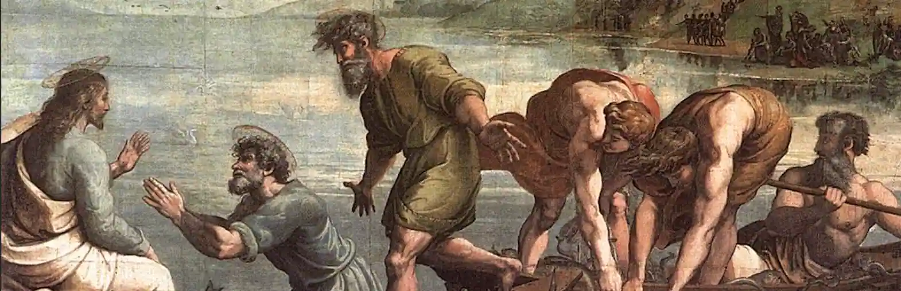

---
outline:
title: Hoy
---

### 04. Problemas preambulares. ¿Filosofía creyente?

**La noción de filosofía cristiana**

§1. Cuando se plantea el problema en los términos que acabamos de definir, el método más sencillo para resolverlo es preguntarnos por qué ciertos hombres cultos, versados en el conocimiento de los sistemas de la antigüedad, pudieron decidirse súbitamente a hacerse cristianos. El hecho no ha cesado de producirse, y del mismo modo pudiéramos preguntarnos por qué, aun en nuestros días, tantos filósofos creen hallar en el Cristianismo una respuesta a los problemas filosóficos más satisfactoria que las de la filosofía misma. Sin embargo, si queremos examinar la cuestión de modo objetivo y bajo formas en que no intervengan nuestros intereses personales, o que no les den cabida de manera tan inmediata, lo más sencillo es remontarse a los orígenes. Si el Cristianismo ha traído realmente a los filósofos más verdad racional de la que hallaban en la filosofía, la realidad de esa aportación nunca debió ser más sensible que en el momento mismo en que se produjo. Vamos, pues, a preguntar a los primeros filósofos que se hicieron cristianos qué interés hallaban, en cuanto filósofos, en hacerse cristianos.

§2. De hecho, para discutir convenientemente el problema, hay que remontarse aún más allá de los primeros filósofos cristianos. El testigo más antiguo que podemos invocar aquí no es un filósofo, pero no por eso su pensamiento deja de dominar toda la evolución ulterior del pensamiento cristiano: es San Pablo. Puede decirse que con él ya está planteado el principio de la solución definitiva del problema, y que las generaciones ulteriores de filósofos cristianos no harán sino desarrollar sus consecuencias. Según el Apóstol, el Cristianismo no es en modo alguno una filosofía, sino una religión. Él no sabe nada, no predica nada, excepto a Jesús crucificado y la redención del hombre pecador por la gracia. Sería, pues, totalmente absurdo tratar de definir una filosofía de San Pablo; y aun cuando en sus escritos se encuentran fragmentos de filosofía griega, están en ellos ora como elementos adventicios, ora, lo más a menudo, como elementos integrados a una síntesis religiosa que les transforma completamente el sentido. El Cristianismo de San Pablo no es una filosofía que se añada a otras filosofías; ni siquiera viene a reemplazarlas: es simplemente una religión que hace inútil lo que de ordinario llamamos filosofía, y de ella nos dispensa. Pues el Cristianismo es un método de salvación, es decir, otra cosa y más que un método de conocimiento; y podemos agregar que nadie, más que San Pablo, ha tenido clara conciencia de esta verdad.

§3. Tal cual ella misma se define en la _I Epístola a los corintios_, la nueva revelación está colocada como una piedra de escándalo entre el judaísmo y el helenismo. Los judíos quieren la salvación por la observancia integral de una ley y la obediencia a las órdenes de un Dios cuyo poder se muestra en milagros de gloria; los griegos quieren una salvación conquistada por la rectitud de la voluntad y una certeza obtenida por la luz natural de la razón. A unos y otros ¿qué les trae el Cristianismo? La salvación por la fe en Cristo crucificado; es decir, un escándalo para los judíos, que reclaman un milagro de gloria, y a quienes se les ofrece en cambio la infamia de un Dios humillado; una locura para los griegos, que reclaman lo inteligible, y a quienes se les propone el absurdo de un Dios-hombre, muerto en la cruz y resucitado de entre los muertos para salvarnos. Lo que el Cristianismo opone a la sabiduría del mundo es, pues, lo impenetrable, el escándalo misterioso de Jesús: "Porque está escrito: destruiré la sabiduría de los sabios y reprobaré la prudencia de los prudentes. ¿Dónde está el sabio? ¿Dónde está el prudente? ¿Dónde está el filósofo del siglo? ¿Acaso Dios no ha vuelto necedad la sabiduría de este mundo? Pues ya que el mundo no ha sabido, por la sabiduría, conocer a Dios en la sabiduría de Dios, plugo a Dios salvar a los que creen por la locura de la predicación. Los judíos piden milagros y los griegos piden sabiduría; nosotros, al contrario, predicamos al Cristo crucificado, escándalo para los judíos, locura para los gentiles; mas para los que son llamados, sea de entre los judíos, sea de entre los gentiles, el Cristo es el poder de Dios y la sabiduría de Dios, porque la locura de Dios es más sabia que la sabiduría de los hombres y la debilidad de Dios más fuerte que la fuerza de los hombres".

§4. Nada más categórico y definitivo, a primera vista, que semejantes declaraciones, puesto que parecen eliminar pura y simplemente la filosofía griega en beneficio de la nueva fe. Por eso, desde luego, no se yerra al resumir el pensamiento de San Pablo sobre este punto central diciendo que, según él, el Evangelio es una salvación, no una sabiduría. Sin embargo, es menester agregar que en otro sentido esa interpretación no es completamente exacta, pues en el momento mismo en que San Pablo proclama la bancarrota de la sabiduría griega, propone substituirla por otra, que es la persona misma de Jesucristo. Lo que él entiende hacer es eliminar la aparente sabiduría griega, que en realidad no es sino locura, en nombre de la aparente locura cristiana, que, en realidad, es sabiduría. En vez de decir que, según San Pablo, el Evangelio es una salvación, no una sabiduría, más valdría decir, pues, que la salvación que él predica es a sus ojos la verdadera sabiduría, y eso precisamente porque es una salvación.

§5. Si se admite esta interpretación, y parece bien inserta en el propio texto, claro aparece que, resuelto en su principio, el problema de la filosofía cristiana queda enteramente abierto en cuanto a las consecuencias que de ello se derivan. Lo que San Pablo llegó a afirmar, y que nadie había de discutir jamás en el interior del Cristianismo, es que poseer la fe en Jesucristo, es con mayor razón poseer la sabiduría, por lo menos en el sentido de que, desde el punto de vista de la salvación, la fe nos dispensa real y totalmente de la filosofía. Aun pudiéramos decir que San Pablo define una posición cuya antítesis exacta será formulada en el 1369 Proverbio de Goethe: 

*Wer Wissenschaft und Kunst besitzt*
*Hat auch Religion*;
*Wer jene beide nicht besitzt*
*Der habe Religion* 

[Quien posee ciencia y arte
tiene también religión; 
quien no posee ambas, 
que tenga religión].

§6. Aquí, lo cierto es exactamente lo contrario, pues quien posee la religión posee también, en su verdad esencial, la ciencia, el arte y la filosofía, disciplinas estimables, pero que no pueden servir más que de menguado consuelo a quien no posee la religión. Sólo que, si es cierto que poseer la religión es tener todo lo demás, hay que demostrarlo. Un apóstol como San Pablo puede conformarse con predicarlo; un filósofo querrá asegurarse de ello. No basta con decir que el creyente puede pasar sin filosofía porque todo el contenido de la filosofía, y aun más, está implícitamente dado en su creencia: es necesario presentar la prueba de ello. Ahora bien: probarlo es seguramente cierto modo de suprimir la filosofía; pero, si la empresa tiene éxito, puede decirse que en otro sentido es quizá la mejor manera de filosofar. ¿Qué ventajas filosóficas hallaban, pues, en convertirse los más antiguos testigos que se convirtieron al cristianismo?

§7. Aquel cuyo testimonio resulta a la vez el más antiguo y el más típico es San Justino, cuyo _Diálogo con Trifón_ nos refiere la conversión en forma viva y pintoresca. Tal como lo concibe desde el comienzo, el objeto de la filosofía es conducirnos hacia Dios y unirnos a Él. El primer sistema ensayado por Justino fué el estoicismo; pero parece que dió con un estoico más cuidadoso de práctica moral que de teoría, pues este profesor reconoció que no tenía por necesaria la ciencia de Dios. El peripatético que le sucedió insistió muy pronto en que convinieran el precio de sus lecciones, lo que Justino estimó poco filosófico. Su tercer profesor fué un pitagórico, que, a su vez, lo despidió porque aún no había aprendido la música, la astronomía y la geometría, ciencias indispensables para el estudio de la filosofía. Un platónico, que vino después, fué más afortunado: "Le frecuenté cuanto más a menudo pude —escribe Justino—, y de ese modo hice progresos; cada día adelantaba lo más posible. La inteligencia de las cosas corporales me cautivaba en grado sumo; la contemplación de las ideas daba alas a mi espíritu, tanto que luego de corto tiempo creí haber llegado a ser sabio; hasta fuí bastante necio para esperar que llegaría a ver a Dios, pues tal es el fin de la filosofía de Platón". Todo iba, pues, a medida de su deseo, cuando Justino se encontró con un anciano que, interrogándolo sobre Dios y el alma, le probó que se hallaba metido en extrañas contradicciones; y como Justino le preguntara dónde había adquirido sus conocimientos en aquellas materias, el anciano contestó: "Hubo en tiempos remotos, y más antiguos que todos esos supuestos filósofos, hombres felices, justos y queridos de Dios, que hablaban por el Espíritu Santo y daban sobre lo porvenir oráculos que ahora se han cumplido: se les llama profetas... Sus escritos subsisten aún hoy, y quienes los leen pueden, si tienen fe en ellos, sacar toda clase de provechos, tanto sobre los principios como sobre el fin, acerca de todo lo que debe conocer el filósofo. No han hablado por medio de demostraciones; por encima de toda demostración, eran los dignos testigos de la verdad". Al escuchar estas palabras, un fuego súbito se encendió en el corazón de Justino, y dice, "reflexionando a solas en esas palabras, encontré que esa filosofía era la única segura y provechosa. He ahí cómo y por qué soy filósofo".

§8. Οὕτως͵ δὴ καὶ διὰ ταῦτα φιλόσοφος ἐγώ [Así, pues, y por esto soy filósofo]. Casi no es posible exagerar la importancia de estas palabras; y si hemos referido con algunos pormenores la experiencia personal de Justino es porque, desde el siglo II, ponen en evidencia todos los elementos sin los cuales no hay solución para el problema de la filosofía cristiana. Un hombre busca la verdad valiéndose únicamente de la razón, y fracasa; la fe le ofrece la verdad, la acepta, y, luego de aceptarla, la halla satisfactoria para la razón. Pero la experiencia de Justino no es menos instructiva en otro aspecto, pues promueve un problema al que Justino mismo no ha podido dejar de prestar atención. Lo que él encuentra en el Cristianismo, junto con otras muchas cosas, es la llegada de verdades filosóficas por vías no filosóficas. Donde reina el desorden de la razón, la revelación hace reinar el orden; pero precisamente por haberlo ensayado todo sin temor de contradecirse, los filósofos habían dicho, conjuntamente con muchas cosas falsas, gran número de cosas ciertas. ¿Cómo explicar, entonces, que llegaran a tener conocimiento de esas verdades, aun en la forma fragmentaria en que las conocieron?

§9. Una primera solución de ese problema, propuesta por Filón el Judío, tentó inmediatamente la imaginación de los cristianos y la sedujo durante mucho tiempo. Era una solución poco dificultosa, cuyo éxito radicó en su propia facilidad. ¿Por qué no prevalerse de la anterioridad cronológica de la Biblia con relación a los sistemas filosóficos? Se sostuvo, pues, primero con cierta timidez, pero con más decisión a partir de Taciano, que los filósofos griegos se habían aprovechado, más o menos directamente, de los libros revelados y les debían las pocas verdades que habían enseñado, no sin mezclarlas, por lo demás, con bastantes errores. Sin embargo, la ausencia de toda prueba directa de que los habían utilizado debía oponerse al éxito completo de esta solución simplista; y aun cuando tuvo larga vida, a tal punto que probablemente aún no esté muerta, debió ir apartándose progresivamente ante otra, mucho más profunda y además casi tan antigua como ella, puesto que ya la encontramos en San Justino.

§10. Digamos que hasta en San Pablo la encontramos ya, por lo menos en germen y como preformada. A pesar de su despreciativa condenación de la falsa sabiduría de los filósofos griegos, el Apóstol no condena la razón, pues quiere reconocerles a los gentiles cierto conocimiento natural de Dios. Al afirmar en la _Epístola a los romanos_ (I, 19-20) que el poder eterno y la divinidad de Dios pueden ser directamente conocidos por el espectáculo de la creación, San Pablo afirmaba implícitamente la posibilidad de un conocimiento puramente racional de Dios en los griegos y al mismo tiempo echaba el fundamento de todas las teologías naturales que más tarde habían de constituirse en el seno del mismo Cristianismo. De San Agustín a Descartes no hay un solo filósofo que no se haya manifestado de acuerdo con tales conceptos. Por otra parte, al declarar en la misma Epístola (II, 14-15) que los gentiles, aunque estén desprovistos de la Ley Judía, son ley para sí mismos, porque su conciencia les acusará o les excusará en el día del juicio, San Pablo admite implícitamente la existencia de una moral natural o, más bien, de un conocimiento natural de la ley moral. Ahora bien: aun cuando el Apóstol no se haya planteado esta cuestión puramente especulativa, desde ese momento era imposible que no se planteara este otro interrogante: ¿qué relaciones hay entre el conocimiento racional de lo verdadero o del bien concedido por Dios al hombre y el conocimiento revelado que el Evangelio ha venido a agregar al primero? Ése es precisamente el problema que San Justino ha planteado y resuelto.

§11. Puesto que se pregunta Jesucristo nació ciento cincuenta años antes de la fecha en que escribo, ¿cómo debo considerar a los hombres que, viviendo antes de Cristo, estuvieron desprovistos del auxilio de la revelación? ¿A todos culpables o a todos inocentes? El Prólogo del _Evangelio de San Juan_ sugiere la respuesta que conviene dar a esta pregunta. Jesucristo es el Verbo, y el Verbo es Dios; ahora bien: está dicho en el Evangelio que el Verbo ilumina a todo hombre que llega a este mundo; de ahí resulta, pues, que debemos admitir, por el testimonio de Dios, una revelación natural del Verbo, universal y anterior a la que se produjo cuando, haciéndose carne, vino a habitar entre nosotros. Por otra parte, puesto que el Verbo es el Cristo, todos los hombres han participado en la luz del Cristo al participar en la del Verbo. Los que han vivido según el Verbo, ya fueran paganos o judíos, han sido, pues, cristianos por definición, en tanto que quienes han vivido en el error y en el vicio, es decir, contrariamente a lo que les enseñaba la luz del Verbo, han sido verdaderos enemigos de Cristo desde antes de su llegada. Si es así, la suposición de San Pablo, aun permaneciendo materialmente la misma, se halla espiritualmente transformada, pues donde el Apóstol invocaba contra los paganos una revelación natural que los condena, San Justino admite en favor de aquéllos una revelación natural que los salva. Sócrates llega a ser un cristiano tan fiel, que no es sorprendente que el diablo hiciera de él un mártir de la verdad, y Justino no está lejos de decir con Erasmo: "¡San Sócrates, ruega por nosotros!"

§12. A partir de ese momento decisivo, el Cristianismo acepta, pues, la responsabilidad de toda la historia anterior de la humanidad, pero también reclama el beneficio. Todo lo mal hecho se ha hecho contra el Verbo, pero puesto que inversamente todo lo bien hecho se ha hecho por el Verbo, que es el Cristo, toda verdad es cristiana por definición. Cuanto bien se ha dicho es nuestro: ὅσα οὖν παρὰ πᾶσι καλῶς εἴρηται, ἥμων χριστιανῶν ἔστιν [cuanto de bueno ha sido dicho por todos, nos pertenece a los cristianos]. He ahí, formulada ya en el siglo II, en términos definitivos, la regla eterna del humanismo cristiano. Heráclito es de los nuestros; Sócrates nos pertenece, puesto que ha conocido al Cristo con un conocimiento parcial, gracias al esfuerzo de una razón cuyo origen es el Verbo; nuestros son también los estoicos y, con ellos, todos los verdaderos filósofos en quienes brillaban ya las semillas de esa verdad que la revelación nos descubre hoy en su plenitud.

§13. Para quien decide adoptar esta perspectiva sobre la historia, sigue siendo verdad el decir con San Pablo que la fe en Cristo dispensa de la filosofía y que la revelación la suplanta, pero la revelación no suplanta a la filosofía sino porque la perfecciona. De ahí un trastrueque del problema, tan curioso como inevitable. Si todo lo que había de verdadero en la filosofía era un presentimiento y como un esbozo del Cristianismo, quien posee el Cristianismo debe por eso mismo poseer todo lo que había de verdadero y todo lo que por siempre puede haber de verdadero en la filosofía. En otros términos, y por más extraño que esto pueda parecer, la posición racional más favorable no es la del racionalista, sino la del creyente; la posición filosófica más favorable no es la del filósofo, sino la del cristiano. Para cerciorarse de ello bastará con enumerar las ventajas que ésta presenta.

§14. Pudiéramos hacer observar en primer lugar que la gran superioridad del Cristianismo consiste en la de no ser un simple conocimiento abstracto de la verdad, sino un método eficaz de salvación. El punto puede parecer hoy sin relación directa con la noción de filosofía, porque la confundimos más o menos con la ciencia; mas tanto para el Platón del _Fedón_ como para el Aristóteles de la _Ética a Nicómaco_, aun cuando fuese esencialmente ciencia, la filosofía no era sólo eso; era también un sistema de vida; y llegó a serlo a tal punto con los estoicos y sus sucesores, que esos filósofos se distinguían de los demás hombres por su vestidura, del mismo modo que un sacerdote se distingue hoy por la suya de los hombres que lo rodean. Ahora bien: es un hecho comprobado que los sistemas griegos aparecieron a los ojos de los cristianos del siglo II como especulaciones interesantes y aun a veces verdaderas, pero sin eficacia para la conducta de la vida. Al contrario, por el hecho de que prolongaba el orden natural mediante un orden sobrenatural y apelaba a la gracia como a una fuente inagotable de energía para la aprehensión de lo verdadero y la realización del bien, el Cristianismo se ofrecía a la vez como una doctrina y una práctica, o, más exactamente, como una doctrina que traía al mismo tiempo los medios de ponerla en práctica.

§15. Facilísimo sería acumular ejemplos históricos en apoyo de esta interpretación del Cristianismo, pero sin duda será suficiente recordar que aquí reside todo lo esencial de la doctrina de San Pablo sobre el pecado, la Redención y la gracia. Lo que el hombre quisiera hacer, no lo hace; lo que no quisiera hacer, lo hace. Una cosa es querer hacer el bien, y otra poder hacerlo; una es la ley de Dios que reina en el hombre interior, y otra la ley del pecado que reina en sus miembros. ¿Y quién, pues, hará reinar la ley de Dios en el hombre exterior, sino Dios mismo, por la gracia de Jesucristo? Nada más conocido que esta doctrina. En cambio, lo que a veces parece olvidarse es que esa doctrina está en el centro mismo de la obra de San Agustín y, por ende, de todo el pensamiento cristiano. Se ha discutido por mucho tiempo sobre el sentido del testimonio de las _Confesiones_, considerando algunos que San Agustín se convirtió al neoplatonismo más bien que al Cristianismo y sosteniendo otros, por el contrario, que su conversión fué la de un verdadero cristiano. Personalmente no dudo de que la segunda hipótesis sea la verdadera; pero si ciertos autores han creído posible sostener la primera con gran refuerzo de textos y argumentos, es precisamente por no haber comprendido que el Cristianismo es esencialmente un método de salvación y que, por consiguiente, convertirse al Cristianismo es esencialmente adherir a este método de salvación. Ahora bien: si hay un punto evidente entre todos los que toca el relato de las _Confesiones_, ese punto es justamente aquél donde San Agustín nos dice que, a su juicio, el vicio radical del neoplatonismo reside en la ignorancia en que nos deja de la doble doctrina del pecado y de la gracia que nos libra de él. Se puede demostrar que la evolución intelectual de San Agustín se perfecciona con su adhesión al neoplatonismo, y aun pudieran formulársele muchas restricciones, con elementos proporcionados por el mismo San Agustín, a esta interpretación; empero, lo que toda su doctrina niega, es que dicha adhesión pueda confundirse con su conversión. Bien está que Plotino nos aconseje que nos desprendamos de nuestros sentidos, dominemos nuestras pasiones y adhiramos a Dios; pero, ¿acaso es Plotino quien nos dará fuerzas para hacerlo? ¿Y de qué sirve saber sin poder? ¿Qué médico es ése que aconseja la salud sin conocer ni la naturaleza de la enfermedad, ni la del remedio? La conversión de San Agustín no se perfecciona ampliada y acabadamente sino por la lectura de San Pablo y la revelación de la gracia: "Pues la ley del Espíritu de vida en Jesucristo me ha librado de la ley del pecado y de la muerte". No era un intelecto el que sufría en la noche del jardín de Cassiciacum, era un hombre.

§16. Volvamos, sin embargo, al plano de la filosofía puramente especulativa y del conocimiento abstracto; ahí también habremos de reconocer que para los primeros pensadores cristianos se les ofrecían muchas ventajas con el terreno de la religión. Uno de los argumentos que más fácilmente invocan en favor de su fe es el que se funda en las contradicciones de los filósofos. El hecho es bien conocido, pero su significación quizá no sea la que comúnmente se imagina. Lo que parece haber impresionado a Justino y a sus sucesores no es solamente la incoherencia de las especulaciones filosóficas, sino sobre todo la coherencia de las respuestas dadas a los problemas filosóficos por una doctrina que, en lugar de ofrecerse como una filosofía entre tantas otras, se hacía pasar por la única verdadera religión.

§17. Encarada bajo su aspecto polémico, esta comprobación engendra el argumento clásico "por las contradicciones de los filósofos". Lo encontramos por doquier en los primeros siglos del pensamiento cristiano: en Justino, de quien he recordado que fué el punto de partida; en el _Discurso a los griegos_, de Taciano, donde recibió su pleno desarrollo; en el anónimo _Burla de los filósofos_; en Arnobio, cuyo escepticismo filosófico y fideísmo justifica; pero quizá deba decirse que fué sobre todo en Lactancio, porque este hombre de buen sentido midió el alcance exacto y lo señaló en términos definitivos. A pesar de las injurias que no dejó de dirigirles cuando se presentó la ocasión, Lactancio tuvo trato frecuente con los filósofos. Persuadido de que hay mucho de bueno en Sócrates, en Platón, en Séneca, este cristiano acaba por reconocer que en realidad cada uno de ellos ha alcanzado una parte de la verdad total y que, si se juntaran esas partes, se llegaría a reconstituir la verdad entera: _particulatim veritas ab iis tota comprehensa est_ [la verdad ha sido comprendida en su totalidad por ellos de forma fragmentaria]. Supongamos, pues, que a alguien se le ocurriera recoger esos fragmentos dispersos entre los escritos de los filósofos y reunirlos en un cuerpo de doctrina: lo que obtendría por este método sería un equivalente de la verdad total; pero, y éste es el punto esencial, nadie puede obrar esa separación entre lo verdadero y lo falso en los sistemas de los filósofos, a menos que por anticipado conozca la verdad, y nadie la conoce por anticipado si Dios no se la enseña por la revelación, es decir, si no la acepta por la fe.

§18. Lactancio concibió, pues, la posibilidad de una filosofía verdadera, pero la concibió como un eclecticismo basado en la fe. De un lado está el filósofo puro y simple, que no dispone más que de su razón y quiere descubrir la verdad por sus propias fuerzas: todo su empeño sólo le conduce a alcanzar un minúsculo fragmento de la verdad total, envuelto en una masa de errores contradictorios de los que es incapaz de separarla. Del otro lado está el filósofo cristiano: su fe lo pone en posesión de un criterio, de una regla de juicio, de un principio de discernimiento y de selección, que le permiten hacer que la verdad se vuelva racional a sí misma, liberándola del error en que se enreda. _Solus potest scire qui fecit_ [Solo puede saberlo quien lo hizo], dice Lactancio. Dios, que todo lo ha hecho, todo lo sabe. Sigámosle, si nos enseña. Entre la incertidumbre de una razón sin guía y la certidumbre de una razón dirigida, no titubea un instante, y después de él tampoco vacilará San Agustín.

§19. Porque, en verdad, es ésa la misma experiencia que seguirá repitiéndose, hasta que termine por encontrar su fórmula abstracta en los escritos de los pensadores de la Edad Media y sea redescubierta por más de un pensador moderno. Cuando el joven Agustín adhiere a la secta de Manes es precisamente porque los maniqueos se jactan de explicarlo todo sin acudir jamás a la fe. A pesar de las extrañezas y puerilidades de su cosmogonía, son racionalistas que pretenden introducir el raciocinio en la fe dándole primero la inteligencia. Si, cansado de una iglesia en la que la inteligencia prometida no llega jamás, Agustín se aleja finalmente de la secta, es para entregarse al amable escepticismo de Cicerón; y cuando emerge de ese escepticismo gracias a Plotino, es para descubrir a poco que todo cuanto había de verdad en el neoplatonismo estaba ya contenido en el _Evangelio de San Juan_ y en el libro de la _Sabiduría_, y juntamente con otras muchas verdades que Plotino mismo jamás llegó a conocer. Así, mientras la buscaba en vano por la razón, la sabiduría estaba ahí, esperándolo, y se ofrecía a él por la fe. Aquellas verdades vacilantes, que la especulación griega reservaba a un reducido grupo de espíritus selectos, estaban por anticipado reunidas, purificadas, fundadas, completadas por una revelación que las pone al alcance de todos los hombres. En ese sentido, podríamos sin inexactitud resumir toda la experiencia de Agustín en el título que él mismo dió a una de sus obras: _De utilitate credendi_ [De la utilidad de creer]. De la utilidad de creer, aun para asegurar la racionalidad de la razón. Si repite sin cesar la frase de Isaías tal cual la encuentra en la traducción latina que él utiliza: _nisi credideritis, non intelligetis_ [si no creyereis, no entenderéis], es porque ésta es la fórmula exacta de su experiencia personal; y San Anselmo no tendrá que agregarle nada cuando a su vez quiera definir el efecto bienhechor de la fe sobre la razón del filósofo.

§20. La actitud de San Anselmo en esta materia ha sido presentada como un racionalismo cristiano. La expresión se presta a equívoco, pero tiene por lo menos el mérito de poner en evidencia el hecho que cuando acude a la razón, San Anselmo tiene el propósito de habérselas pura y exclusivamente con la razón. No sólo él, sino sus oyentes mismos exigen que nada se interponga entre los principios racionales de que parte y las conclusiones racionales que de ellos deduce. Basta con recordar el famoso prefacio del _Monologium_ en el que, cediendo a la insistencia de sus alumnos, se compromete a no probar nada de lo que está en la Escritura por la autoridad de la Escritura, sino a establecer por la evidencia de la razón y por la sola luz natural de la verdad todo lo que una investigación independiente de la revelación podrá hacer aparecer como verdadero. Y sin embargo, fué San Anselmo quien dió la fórmula definitiva de la primacía de la fe sobre la razón, pues si la razón quiere ser plenamente razonable, si quiere satisfacer como razón, el único método seguro para ella consiste en escrutar la racionalidad de la fe. En cuanto tal, la fe se basta, pero aspira a transmutarse en una inteligencia de su propio contenido; no depende de la evidencia de la razón, sino que, al contrario, ella es quien la engendra. Sabemos por el propio San Anselmo, que el título primitivo de su _Monologium_ fué: _Meditación sobre la racionalidad de la fe_, y que el título de su _Proslogion_ no era otro sino la famosa fórmula: _Una fe que busca la inteligencia_. Nada expresa con más justeza su pensamiento, pues que no trata de comprender para creer, sino de creer para comprender; a tal punto, que esta primacía de la fe sobre la razón, la cree antes de comprenderla, y para comprenderla, puesto que le es propuesta por la autoridad de la Escritura: _nisi credideritis, non intelligetis_ [si no creyereis, no entenderéis].

§21. San Justino, Lactancio, San Agustín y San Anselmo no son más que cuatro testigos. ¡Pero qué testigos! Su autoridad y la perfecta concordancia de sus experiencias me dispensarán, así lo espero, de invocar los innumerables testimonios que pudieran agregarse a los suyos. Sin embargo, antes de dejar este punto quisiera hacer oír también una voz que les contesta a través de los siglos, para atestiguar la perennidad de la cuestión y la necesidad de la respuesta. Alegar las conclusiones últimas de Maine de Biran, es echar en la balanza la experiencia de toda una vida. Él también, como San Agustín, como tantos otros, intentó resolver los enigmas de la filosofía valiéndose únicamente de su razón, y las últimas palabras escritas en su _Diario intimo_ son el _Vae soli_ [Ay del solo] de la Escritura: "Es imposible negar al verdadero creyente, que siente en sí mismo lo que él llama los efectos de la gracia, que halla su reposo y toda la paz de su alma en la intervención de ciertas ideas o actos intelectuales de fe, de esperanza y de amor, y que de ahí hasta consigue satisfacer su espíritu sobre problemas insolubles en todos los sistemas, es imposible, digo, refutarle lo que experimenta y, por consiguiente, dejar de reconocer el fundamento verdadero que tienen en él o en sus creencias religiosas, los estados de ánimo que hacen su consolación y su felicidad". Es, pues, un hecho para el cristiano que la razón sola no basta a la razón y que no sólo en el siglo II se convirtieron filósofos al Cristianismo en interés de su propia filosofía. Al _fides quarens intellectum_ [la fe que busca la inteligencia] de San Anselmo y de San Agustín corresponde el _intellectus quarens intellectum per fidem_ [el intelecto que busca el intelecto por la fe] de Maine de Biran. _Optavi et datus est mihi sensus, invocavi et venit in me spiritus sapientiae_ [Deseé, y me fue dado el sentido; invoqué, y vino a mí el espíritu de sabiduría]; ese esfuerzo de la verdad creída por transformarse en verdad sabida, es verdaderamente la vida de la sabiduría cristiana, y el cuerpo de las verdades racionales que ese esfuerzo nos entrega, es la filosofía cristiana misma. El contenido de la filosofía cristiana es, pues, el cuerpo de las verdades racionales que han sido descubiertas, profundizadas o simplemente salvaguardadas, gracias a la ayuda que la revelación ha prestado a la razón. Si esta filosofía ha existido realmente o si no es más que un mito, es una cuestión de hecho que pediremos a la historia que ella decida; pero antes de abordar ese punto quisiera disipar una mala interpretación que, al obscurecer el sentido del _fides quarens intellectum_ [la fe que busca la inteligencia], hace ininteligible la noción misma de filosofía cristiana.

§22. A menos de vaciar esta expresión de todo contenido positivo, es menester admitir francamente que sólo una relación intrínseca de la revelación a la razón le da un sentido. Y aun importa que ese sentido sea exactamente definido. No se trata en modo alguno de sostener que la fe sea un tipo de conocimiento superior al del conocimiento racional. Jamás lo pretendió nadie. Al contrario, es evidente que el creer es un simple sucedáneo del saber y que, todas las veces que sea posible, substituir la creencia por la ciencia es siempre para el entendimiento una ganancia positiva. La jerarquía tradicional de los modos de conocimiento, en los pensadores cristianos, es siempre la fe, la inteligencia, la vista de Dios cara a cara: "_Inter fidem et speciem_" [Entre la fe y la visión] —escribe San Anselmo— "_intellectum quem in hac vita capimus esse medium intelligo_" [entiendo que la inteligencia que alcanzamos en esta vida es un término medio].

§23. Tampoco se trata de sostener el absurdo de que se pueda aceptar por la fe la premisa mayor de un silogismo y extraer ciencia de su conclusión. Si se parte de una creencia para deducir su contenido, nunca se obtendrá más que creencia. Los que reprochan a quienes definen el método de la filosofía cristiana por el _fides quarens intellectum_ [la fe que busca la inteligencia] de confundir teología y filosofía, muestran simplemente que no entienden de ningún modo la posición de aquéllos, y aun dan lugar a pensar que no entienden bien lo que es la teología. Pues aun cuando la teología es una ciencia, en modo alguno se da por fin transformar en inteligencia la creencia por la cual adhiere a sus principios, lo que para ella equivaldría a destruir su propio objeto. Por otra parte, tanto como el teólogo, el filósofo cristiano no intentará transformar la fe en ciencia por una extraña química que pretendiera combinar esencias contradictorias. Lo que se pregunta simplemente el filósofo cristiano es si, entre las proposiciones que él cree verdaderas, no hay cierto número que su razón pudiera saber verdaderas. Mientras el creyente estriba sus asertos sobre la convicción íntima que su fe le confiere, permanece puro creyente y aún no ha entrado en el dominio de la filosofía; pero en cuanto halla entre sus creencias verdades que pueden llegar a ser objetos de ciencia, se convierte en filósofo. Y si esas luces filosóficas nuevas se las debe a la fe cristiana, se convierte entonces en un filósofo cristiano.

§24. El desacuerdo presente que separa a los filósofos sobre el sentido de esa noción se vuelve por eso mismo más fácil de explicar. Algunos consideran a la filosofía en sí misma, en su esencia formal y haciendo abstracción de las condiciones que presiden tanto su constitución como su inteligibilidad. En este sentido, está claro que una filosofía no podría ser cristiana, ni tampoco judía o musulmana; y que la noción de filosofía cristiana no tiene mayor sentido que la de física o matemática cristiana.

§25. Otros, teniendo en cuenta el hecho evidente que, para un cristiano, la fe desempeña el papel de principio regulador extrínseco, admiten la posibilidad de una filosofía cristiana; empero, cuidadosos por conservarle a la filosofía la pureza formal de su esencia, consideran como cristiana toda filosofía verdadera que presente "una concepción de la naturaleza y de la razón abierta a lo sobrenatural". No es dudoso que ése sea uno de los caracteres esenciales de la filosofía cristiana; pero no es el único, ni quizá el más profundo. Una filosofía abierta a lo sobrenatural sería seguramente una filosofía compatible con el Cristianismo, y no sería necesariamente una filosofía cristiana. Para que una filosofía merezca verdaderamente ese título, es menester que lo sobrenatural descienda, a título de elemento constitutivo, no en su textura, lo que sería contradictorio, sino en la obra de su constitución. Llamo, pues, filosofía cristiana a toda filosofía que, aun cuando haga la distinción formal de los dos órdenes, considere la revelación cristiana como un auxiliar indispensable de la razón. Para quien lo entiende así, esta noción no corresponde a una esencia simple susceptible de recibir una definición abstracta; más bien corresponde a una realidad histórica cuya descripción solicita. No es más que una de las especies del género filosofía y contiene en su extensión los sistemas de filosofía que no han sido lo que fueron sino porque existió una religión cristiana y sufrieron voluntariamente su influencia. En cuanto realidades históricas concretas, esos sistemas se distinguen unos de otros por sus diferencias individuales; empero, por el hecho de constituir una especie, presentan caracteres comunes que autorizan a agruparlos bajo una misma denominación.

§26. En primer lugar, y ése es quizá el rasgo más distintivo de su actitud, el filósofo cristiano es un hombre que opera una elección entre los problemas filosóficos. En uso de su derecho, es capaz de interesarse en la totalidad de esos problemas tanto como cualquier otro filósofo; empero, de hecho, se interesa únicamente o sobre todo por aquellos cuya solución importa a la conducta de su vida religiosa. Lo demás, indiferente en sí, es objeto de lo que San Agustín, San Bernardo y San Buenaventura estigmatizan con el nombre de curiosidad: _vana curiositas, turpis curiositas_ [vana curiosidad, torpe curiosidad]. Aun los filósofos cristianos tales como Santo Tomás, cuyo interés se extendía al conjunto de la filosofía, no han hecho obra creadora sino en un dominio relativamente restringido. Nada más natural. Puesto que la revelación cristiana no nos enseña más que las verdades necesarias para la salvación, su influencia no ha podido extenderse sino a las partes de la filosofía que conciernen a la existencia de Dios y su naturaleza, el origen de nuestra alma, su naturaleza y su destino. En el título mismo y en las primeras líneas de su tratado _Del conocimiento de Dios y de sí mismo_, Bossuet ha hecho entrar la enseñanza de una tradición de dieciséis siglos: "La sabiduría consiste en conocer a Dios y en conocerse a sí mismo. El conocimiento de nosotros mismos ha de llevarnos al conocimiento de Dios". No hay quien no reconozca en esas fórmulas el _noverim me, noverim te_ [que me conozca, que te conozca] de San Agustín; y aunque Santo Tomás no lo hiciera expresamente suyo, lo puso en práctica. No se trata de disminuir sus méritos como intérprete y comentarista de Aristóteles; sin embargo, no es en eso donde se muestra más grande, sino en los geniales puntos de mira que señala y, por los cuales, prolongando el esfuerzo de Aristóteles, lo sobrepasa. Esos puntos de mira, esas apreciaciones, las encontramos referentes a Dios, al alma o a la relación del alma con Dios. Y aun muy a menudo será necesario extraer las más profundas de entre ellas de contextos teológicos donde se hallan metidas, porque fué en el seno de problemas teológicos donde efectivamente nacieron. En una palabra: en todos los filósofos cristianos dignos de ese nombre, la fe ejerce una influencia simplificadora y su originalidad se manifiesta sobre todo en la zona directamente sometida a la influencia de la fe: doctrina de Dios, del hombre y de sus relaciones con Dios.

§27. Por el hecho mismo que elimina la vana curiosidad, la influencia de la revelación sobre la filosofía le permite darse un fin y remate. Considerado desde el punto de vista cristiano, el curioso se ha metido en una empresa interminable. De hecho, todo conocimiento racional de cualquier realidad, sea cual fuere, depende de su competencia; de derecho, no hay ninguno del que esté autorizado a decir que, si lo tuviera, éste no transformaría completamente el conocimiento que tiene de todo lo demás. Ahora bien: lo real es inagotable y por consiguiente la tentativa de sintetizarlo en forma de principios es una empresa prácticamente imposible. Hasta puede darse, como lo hará observar Comte más tarde, que la realidad natural no sea sintética y que no sea posible encontrarle una unidad sino considerándola desde el punto de vista de un sujeto. Al elegir al hombre en su relación con Dios como centro de perspectiva, el filósofo cristiano se da un centro de referencia fijo, que le permite introducir en su pensamiento el orden y la unidad. Por eso la tendencia sistemática es siempre fuerte en una filosofía cristiana: tiene menos que sistematizar de lo que tendría otra; y tiene con qué sistematizarlo.

§28. También tiene con qué completarlo, y en primer lugar en el terreno mismo de la filosofía natural. A veces parece suponerse que sólo los agustinianos estuvieron convencidos de ello. De hecho, en la _Suma Contra Gentiles_, lib. I, cap. IV, Santo Tomás nos ha dejado un luminoso resumen de toda la enseñanza de los Padres de la Iglesia sobre esta cuestión fundamental. Luego de preguntarse si conviene que Dios revele a los hombres verdades filosóficas accesibles a la razón, responde que sí, con tal que esas verdades sean de aquéllas cuyo conocimiento es necesario a la salvación. Si fuera de otro modo, esas verdades y la salvación que de ellas depende estarían reservadas a un pequeño número de hombres, quedando los demás privados de ellas por falta de luz intelectual, o de tiempo para la investigación, o de ánimo para el estudio. Agrega que aun los que fueran capaces de alcanzar esas verdades sólo llegarían hasta ellas apenas, luego de haber largamente pensado y pasado la mayor parte de su vida en una ignorancia peligrosa sobre el particular. ¿En qué estado, pues, se hallaría el género humano, según Santo Tomás, si sólo dispusiera de la razón pura para conocer a Dios? _In maximis ignorantiae tenebris_ [En las más grandes tinieblas de la ignorancia]. Y lo confirma con una tercera razón, no menos grave que las otras dos. La debilidad del entendimiento humano, en su condición presente es tal que, sin la fe, lo que a unos parecería evidentemente demostrado sería considerado como dudoso por los otros; por lo demás, el espectáculo de esas contradicciones entre filósofos contribuye no poco a engendrar el escepticismo en el espíritu de los que consideran esas cuestiones desde afuera. Para remediar esa _debilitas rationis_ [debilidad de la razón] el hombre tiene, pues, necesidad de una ayuda divina; y es la fe quien se la ofrece. Como San Agustín y San Anselmo, Santo Tomás ve la razón del filósofo cristiano entre la fe, que guía sus primeros pasos, y el conocimiento pleno de la visión beatífica por venir; como Atenágoras, piensa que el hombre no puede aspirar al perfecto conocimiento de Dios sin ingresar en la escuela de Dios, _qui est sui perfectus cognitor_ [que es perfecto conocedor de sí mismo]. La fe es quien, tomándolo en cierto modo de la mano, lo pone en el buen camino y le acompaña cuanto tiempo sea menester para protegerlo contra el error.

§29. Como puede verse, este cuadro de los resultados obtenidos por la sola razón humana en materia de teología natural no es de los más brillantes, aun cuando ha sido pintado por el más intelectualista de los filósofos cristianos. ¿Por qué, entonces, no seguir tantas indicaciones concordantes, sobre todo si es posible hacerlo sin olvidar distinciones necesarias, que un largo esfuerzo de reflexión ha conquistado penosamente y que la razón impone? Que, tomada en sí y absolutamente, una filosofía verdadera sólo deba su verdad a su racionalidad, es indiscutible; San Anselmo y aun San Agustín fueron los primeros en decirlo; pero que la constitución de esa filosofía verdadera no haya podido llegar a su fin y remate sino con la ayuda de la revelación, obrando como auxilio moral indispensable a la razón, es igualmente cierto, desde el punto de vista de los filósofos cristianos, y terminamos de ver que el mismo Santo Tomás de Aquino lo afirma. Ahora bien: si tuvo razón al afirmarlo, o aun si reconocemos simplemente que pudo tener razón al afirmarlo, el problema de la filosofía cristiana toma un sentido positivo. Puede que abstractamente hablando la filosofía no tenga religión; pero tenemos el derecho de preguntarnos si es indiferente que los filósofos tengan una. Podemos preguntarnos, más particularmente, si es indiferente a la historia de la filosofía como tal, que haya habido filósofos que fuesen cristianos y si, a pesar de la textura puramente racional de sus sistemas, no podríamos leer en ellos, aun hoy, la señal de la influencia ejercida por su fe sobre la conducta de su pensamiento.

§30. La hipótesis, pues de una se trata, no tiene en sí nada de contradictorio e imposible. Supongamos, pues, que San Agustín, San Anselmo y Santo Tomás de Aquino tuvieran conciencia exacta de lo que hacían. Admitamos provisionalmente que, cuando hablan de lo que la razón debe a la revelación, conservan el recuerdo conmovedor de aquellos instantes en que, por la coincidencia de dos luces que van al encuentro una de otra, la opacidad de la fe cedía de pronto en ellos a la transparencia de la inteligencia. Vayamos más allá todavía. Preguntémonos si a veces no fueron más originales de lo que creyeron ser, innovando con inconsciente osadía, gracias a la fe que los llevaba sin dejarse sentir, justamente en lo que creían no hacer más que seguir fielmente a Platón y a Aristóteles. Descubrir en la historia la presencia de una acción ejercida sobre el desarrollo de la metafísica por la revelación cristiana, sería traer una demostración en cierto modo experimental de la realidad de la filosofía cristiana. Nadie pone en duda que la tarea es inmensa y está llena de asechanzas; pero ni siquiera es necesario abrigar esperanzas de éxito para empezarla, pues no podría tratarse de otra cosa sino de esbozarla.

::: info Referencias

Gilson, É. (2009). _El espíritu de la filosofía medieval_. Rialp. (pp. 27-46)

:::